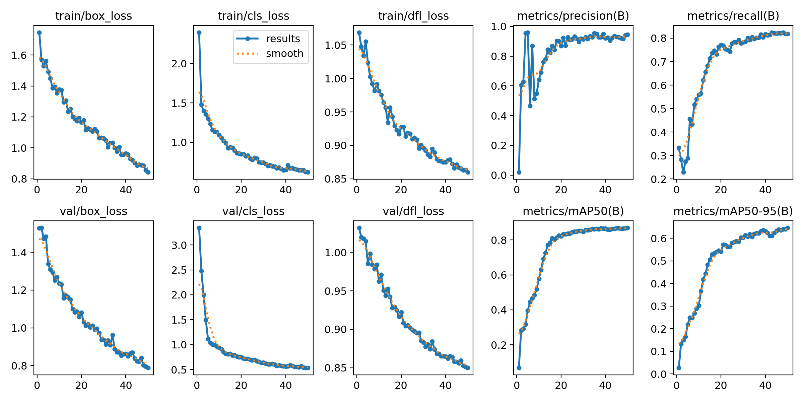
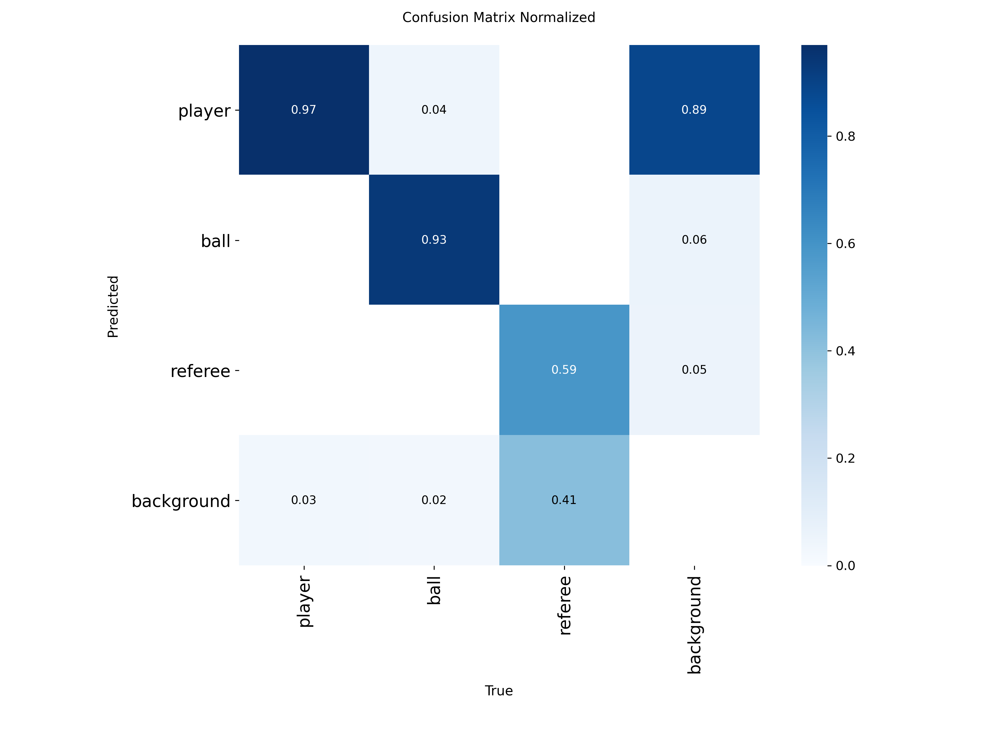

# Notes

> [!IMPORTANT]
> This first report, as stated during it, is trying to analyze a really simple training session which does not include all the variability needed to really asses if the model performs as it should. However, to further understanding of the model's development, it is nevertheless constructed as any other iteration.

## 1. Summary

This first training session was performed over a fully manually 10-seconds clip. Its aim is to provide a preliminary version of a functioning model so it eases the workload needed to annotate clips.

## 2. Dataset

The dataset is intentionally small as it is quite time-consuming to manually annotate even short clips.

- **Source**: Single 10-seconds football clip showing a corner kick.
- **Volume**: 250 annotated frames (aided with interpolation).
- **Split**: 100% Training / 0% Validation
  
> [!NOTE]
> No validation split was used because the dataset consists of a single clip. A validation split is more meaningful when it includes different clips to better assess generalization.

## 3. Training Configuration & Execution

The lightweight YoLov8 Nano model was used for rapid training. In the following table, the basic parameters used are shown.

| Parameter  | Value     |
| ---------- | --------- |
| Model      | `yolov8n` |
| Epochs     | `50`      |
| Image Size | `1280 px` |
| Batch Size | `8`       |

The training session took roughly 5 minutes.

## 4. Key Metrics (:warning: NON REPRESENTATIVE)

The last epoch of the training session obtained the following metrics:

- **mAP50**: 0.8699
- **mAP50-95**: 0.6458
- **Precision**: 0.9455
- **Recall**: 0.8179

Full version available in the [results file](./results.json).

> [!WARNING]
> These metrics are not really representative as the dataset is quite small and there is no Validation Split.

## 5. Training Behavior

### Training Results

#### **Loss Curves**

The **left part of the image** illustrates how accurately the model is able to locate the center of the tracking box (`box_loss`) and predict the corresponding class (`cls_loss`).

The ideal use of these graphs is to compare **Training** with **Validation** results. However, as discussed earlier, there was no Validation Split, so the validation and training data is exactly the same. Therefore, they are quite useless in this case.

#### **Metrics**

The **right part** of the image illustrates the evolution of the most important metrics obtained from the training session.

Regarding **Precision**, the model showed quite some spikes in the first epochs reaching up to 0.96 (and then dropping all the way down to 0.46) but then stabilized and presented a steady progress improving up to the final 0.94 score.

**Recall**, which is how many boxes the model found out of all that should be there, shows a stable evolution growing up to the final 0.82 score.

**mAP50**, which provides a balanced summary of precision and recall at IoU=0.5, grew slowly reaching a final score of 0.87. This means that the training remained stable without divergence. Similarly, **mAP50-95** also grew up to 0.65.

### Confusion Matrix (Normalized)

#### **Player**

The model achieves high accuracy for players (97%) on the training data. However, there is a clear struggle with false positives. The model is prone to confuse the background with a player.

#### **Ball**

Although the ball is arguably the most difficult object to predict due to being small and occasionally occluded, the model has been able to correctly predict 93% of the time.

#### **Referee**

Surprisingly the referee has proven to be the most difficult object to predict in this iteration. The model has predicted its position with a 59% accuracy. It is quite interesting that it has confused several times the referee with the background (41% of the time).

## 6. Key Observations

- **Stability**. The training [loss curves](#loss-curves) do not show spikes in the results, meaning that the batch size and learning rate parameters are appropriate for the hardware and selected base model.
- **The model is conservative**. It has more precision than recall, meaning that it prefers to miss players that are difficult to see rather than making an incorrect guess. However, when looking at the [confusion matrix](#confusion-matrix-normalized), the model seems to struggle with player false positives when looking at the background.
- **It struggles to classify referees**. It confuses them with the background. The main reason for this may be that the model is focusing a lot on colors and the referee's shirt color is quite similar to the turf, therefore confusing the model. It also should be taken into consideration that due to the small size of the dataset, there are not many examples of images of referees.
- **It struggles with new clips**. When using it to annotate it is clear that the model struggles with never-seen footage. This was expected as it was trained over few data.

## 7. Limitations

- **Limited data**. This training iteration has quite limited data. Only a 10 seconds clip (250 frame) is not long enough for the model to really work well.
- **Absence of validation data**. Related to the first limitation, with not enough data, there is no validation split. This leads to results that are not really proven and therefore it is difficult to really know if the model performs well or not.

## 8. Conclusions

The first training session can be called a **success**, providing a model that helps in video annotation which was the main objective at this stage.

## 9. Next Steps

- Extend the dataset and perform the first real iteration with 10 clips (10 seconds each) and Test/Validation splits.
